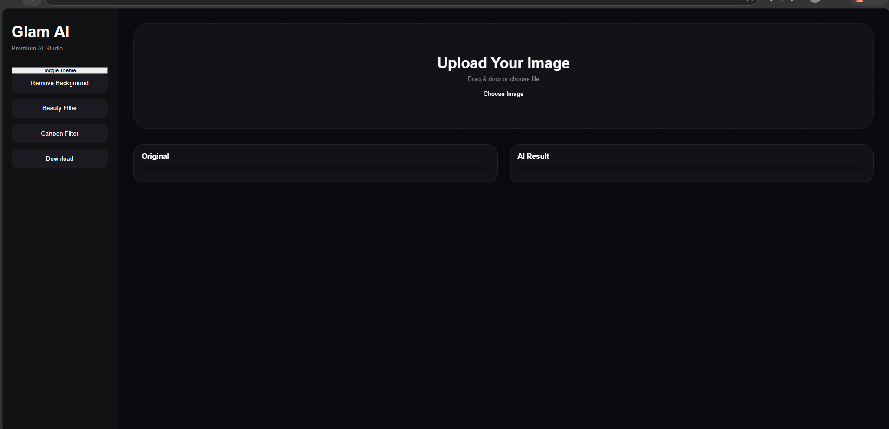
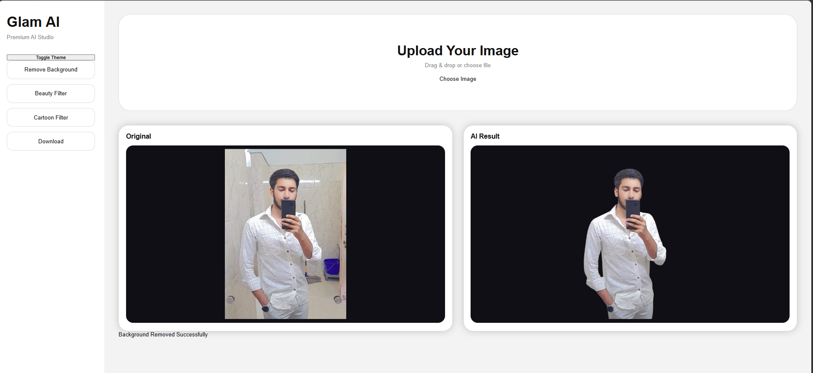
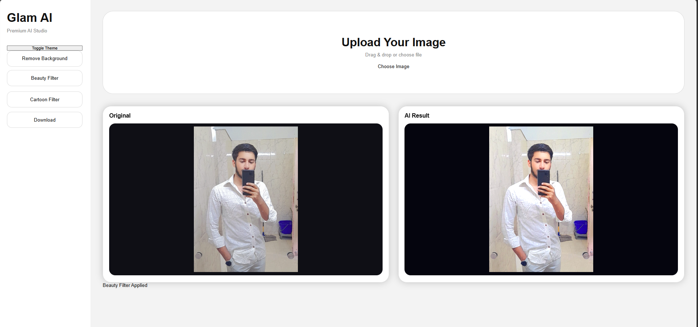
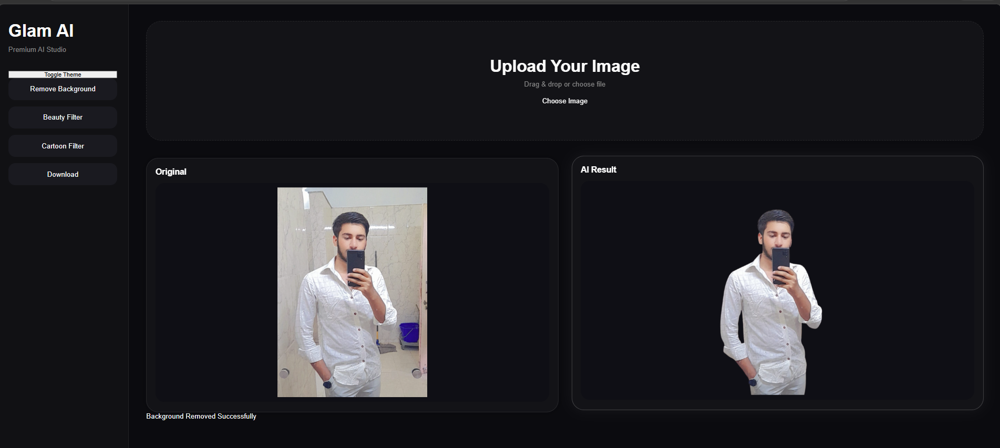
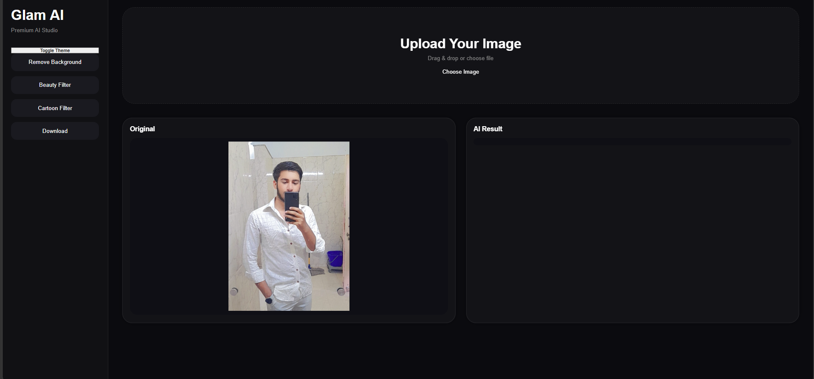
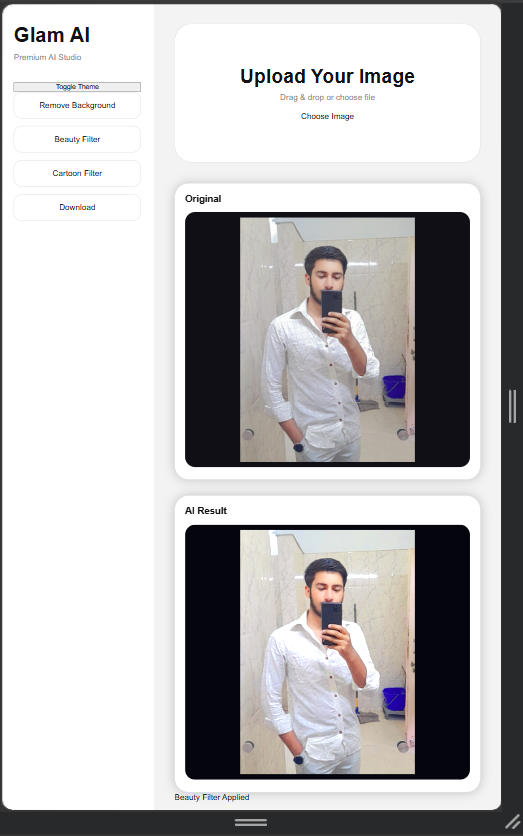

# Glam AI Clone

AI-powered background remover web app built using Flask, HTML, CSS, and JavaScript.

## Features
- AI background removal
- Dark mode UI
- Download processed images
- Responsive mobile design
- Drag & drop upload
- Background filters

## Tech Stack
- Python
- Flask
- HTML
- CSS
- JavaScript
- Remove.bg API

## Run Locally

```bash
pip install -r requirements.txt
python app.py
```
## Preview

## Old Design

### Old UI


### Mobile View


---

## Redesigned Premium UI

### New Home UI


### Light Mode


### Beauty Filter


### Final Result


### Redesigned Layout


### New Mobile Preview
